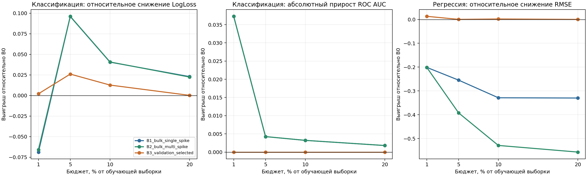
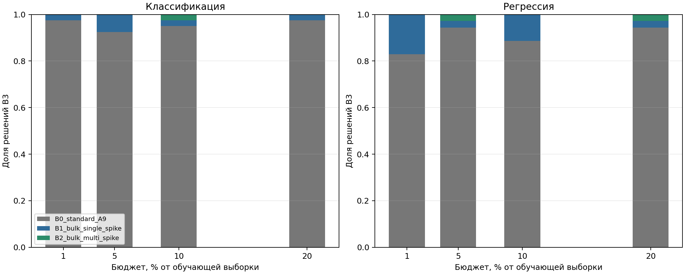

# Анализ завершённого этапа `bulk_spike_full_grid`

Срез сохранён 19 августа 2026 года после завершения всех 1200 запусков.
В анализ вошли 300 полных конфигураций
`dataset × seed × budget × model`, в каждой присутствуют B0, B1, B2 и B3.
Неуспешных и дублирующихся записей нет.

## Вывод

Перерабатывать B1/B2 из-за наблюдаемого ухудшения метрик не требуется.
Эксперимент подтверждает более полезную стратегию: сохранить B0 как безопасный
режим, применять B1/B2 только через B3 и отдельно добавить в селектор явный
режим одной широкой bulk-модели для классификации с малым бюджетом.

B3 выбрал специализированную топологию в 21 из 300 конфигураций (7,0%): B1
в 18 случаях и B2 в трёх. В 20 из 21 случая выбор улучшил основную тестовую
метрику. Единственное ухудшение составило 0,74% RMSE и укладывается в принятый
предел 1%.

## Классификация

Метрики разделены по типу задачи. Для многоклассовых задач используется
относительное снижение LogLoss, для бинарных — абсолютный прирост ROC AUC.
Смешивать эти величины в одно среднее нельзя.

### Выбор B3

- На задачах с LogLoss B3 выбрал B1/B2 семь раз, и все семь выборов улучшили
  тестовую метрику.
- Среднее снижение LogLoss среди выбранных случаев равно 14,58%, медиана —
  5,13%, диапазон — от 0,35% до 36,17%.
- Наиболее сильный и повторяемый результат получен на `segment`: улучшение
  LogLoss на 23,86–36,17% при бюджетах 5–10%.
- На `vehicle` при бюджете 1% выигрыш составил 5,13%; на `jannis` — от 0,35%
  до 4,91%.
- На задачах с ROC AUC B3 всегда оставил B0.

### Кандидаты без отбора B3

| Основная метрика | Бюджет | B1: средний выигрыш | B1: доля побед | B2: средний выигрыш | B2: доля побед |
|---|---:|---:|---:|---:|---:|
| LogLoss | 1% | -6,87% | 40% | -6,58% | 40% |
| LogLoss | 5% | +9,59% | 76% | +9,61% | 80% |
| LogLoss | 10% | +4,05% | 64% | +4,07% | 64% |
| LogLoss | 20% | +2,29% | 76% | +2,24% | 76% |
| ROC AUC | 1% | +0,0373 | 86,7% | +0,0373 | 86,7% |
| ROC AUC | 5% | +0,0043 | 66,7% | +0,0043 | 66,7% |
| ROC AUC | 10% | +0,0032 | 66,7% | +0,0032 | 66,7% |
| ROC AUC | 20% | +0,0018 | 73,3% | +0,0018 | 73,3% |

Результат ROC AUC требует правильной интерпретации: во всех 60 бинарных
конфигурациях B1 и B2 не нашли спектрально допустимый spike и обучили одну
bulk-модель на всём бюджете. Следовательно, выигрыш при 1% — это аргумент в
пользу явного режима `bulk_only`, а не доказательство пользы spike-эксперта.
Сейчас B3 не может выбрать такой режим, поскольку отсутствие spike приводит
к `no_spectrally_eligible_bulk_spike_topology`.

## Регрессия

B3 выбрал B1/B2 в 14 из 140 конфигураций. Тринадцать выборов
улучшили RMSE, один ухудшил его на 0,74% (`elevators`, `seed=42`, бюджет 10%).
Среди выбранных случаев среднее снижение RMSE равно 4,01%, медиана — 1,01%,
лучший результат — 13,33%. Среднее улучшение хвостовой MAE по всем решениям
B3 составляет 1,01%; худшее выбранное значение равно -1,05% и остаётся в
пределе 1,5% профиля `practical_exploration`.

Без B3 прямое применение B1/B2 небезопасно: средние значения RMSE ухудшаются,
а отдельные выбросы очень велики. Это не аргумент в пользу переработки
топологий, а подтверждение, что B3 должен оставаться обязательным защитным
слоем.

## Распределение бюджета

Для 18 случаев, где B3 выбрал B1, медианное распределение обучающего бюджета
составило 63,1% для bulk и 36,9% для spike. В классификации медиана близка к
50/50, в регрессии — 73,8/26,2. Для трёх выборов B2 медиана составила
80,5/19,5.

Маршрутизация обычно использует spike реже, чем следует из обучающей доли.
Для B1 медианная жёсткая доля spike равна 27,7%, мягкая — 33,4%; для B2 —
2,7% и 17,4% соответственно. Значит, небольшой spike-сегмент может быть
полезен даже при редком жёстком выборе эксперта.

В `routing_geometry_replay.csv` поля распределения B2 сейчас учитывают только
ключ `spike` и пропускают `spike_0`, `spike_1`, ... . Для этого анализа доли
B2 пересчитаны из исходного JSONL. В продолжении протокола формирование CSV
исправлено: все поля `spike_*` агрегируются в общую долю spike с проверкой
сохранения полного бюджета. На метрики качества эта ошибка не влияла.

## Почему не пройден порог

Профиль `practical_exploration` не прошёл одну из восьми проверок:
`classification_probability_and_balance_noninferiority`. Причина — только
ограничение `brier_score_gain_vs_b0`; проверки ECE, F1 macro и минимальной
полноты по классам выполнены.

Нарушение найдено в одном случае: `jannis`, `seed=46`, бюджет 20%. B3 выбрал
B1, после чего LogLoss улучшился с 0,768848 до 0,766134, то есть на 0,353%.
Brier score вырос с 0,419225 до 0,424135: абсолютное ухудшение равно 0,004909,
относительное — 1,171%. Предел профиля равен 1%, поэтому он превышен на 0,171
процентного пункта. При этом ECE улучшился на 0,003815, F1 macro снизился лишь
на 0,000624, а минимальная полнота по классам не изменилась.

Порог использует худшее значение по всем классификационным конфигурациям, а не
среднее. В среднем решения B3 улучшают Brier score на 0,519%. Таким образом,
остановку вызвал единичный пограничный случай калибровки вероятностей, а не
систематическое ухудшение классификации и не ошибка выполнения.

После согласованного повышения предела Brier score до 2% повторная проверка
того же набора из 1200 записей получает статус `passed`. Обучение моделей для
этой проверки не повторялось.

Медианное время обучения B1 выше B0 на 5,5%, B2 — на 7,8%. Время предсказания для
обоих режимов примерно вдвое больше. Поскольку B3 выбирает их только в 7,0%
конфигураций, увеличение вычислительной стоимости ограничено, но его нужно
проверить отдельно на `dense_scaling_grid`.

## Что делать дальше

1. Зафиксировать предел Brier score 2% для профиля `practical_exploration`,
   повторить только проверку порога и продолжить `dense_scaling_grid`.
   Перезапуск 1200 записей не требуется; `strict_research` сохраняет предел 1%.
2. Добавить явный кандидат `bulk_only` и разрешить B3 сравнивать его с B0 без
   требования спектрально допустимого spike. Это главный следующий шаг для
   бинарной классификации при бюджете 1%.
3. Сосредоточить повтор классификационных экспериментов на бюджетах 3%, 5%,
   7,5% и 10%. Для LogLoss именно диапазон 5–10% даёт наиболее устойчивый
   выигрыш B1/B2.
4. Сохранить B1 как основной специализированный режим. Исключить B2 из
   `dense_scaling_grid`, сохранив его реализацию для воспроизводимости старых
   результатов. Новый состав этапа: B0, B1, `B4_bulk_only` и B3.
5. Не ослаблять перекрёстный отбор B3 и ограничения для основной метрики.
   Brier score уже входит в многокритериальный отбор; его предел теперь берётся
   из выбранного профиля. Локальную калибровку вероятностей исследовать только
   при повторяемом ухудшении на `dense_scaling_grid`.
6. Проверить вычислительную стоимость B1 и `bulk_only` на плотной бюджетной
   сетке; B1 почти удваивает время предсказания на текущем этапе.

## Ограничения анализа

- Доверительные интервалы по датасетам положительны для LogLoss и RMSE, но
  число независимых датасетов невелико: пять и семь соответственно.
- Прирост на бинарной классификации относится к bulk-only режиму и не должен
  приписываться spike-механизму.
- Выводы о вычислительной стоимости пока основаны на текущей сетке, а не на
  этапе масштабирования.
