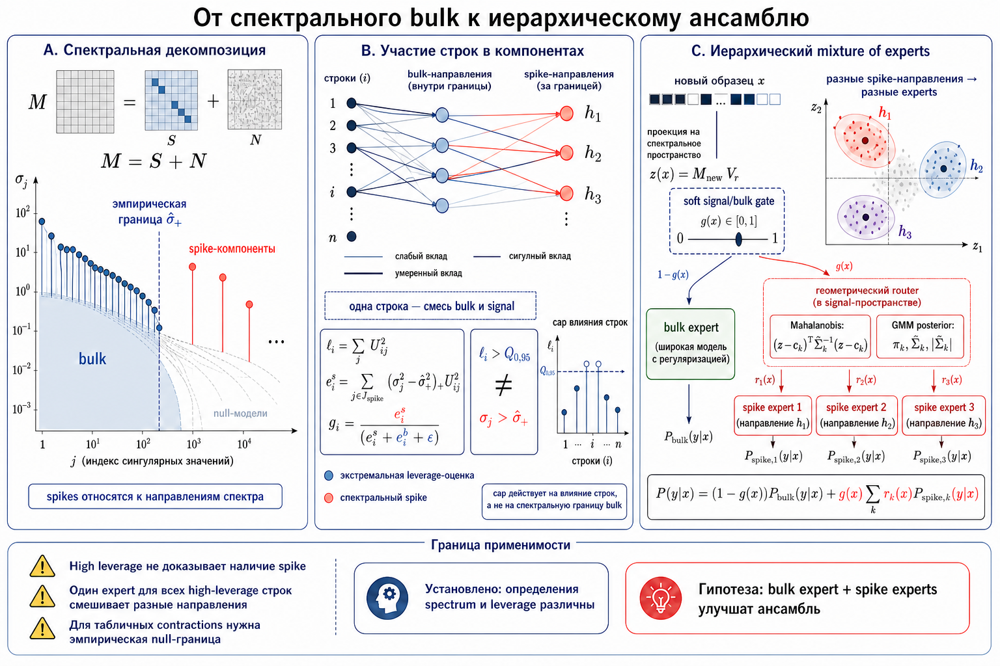

Задача - создание **нового RMT/tensor-contraction sampler**, который:
1. Из плоского табличного датасета строит тензорное многопроекционное представление
2. Формирует чанки для обучения ансамбля фундаментальных моделей;
3. На инференсе участвует в роутинге: оценивает, к какому чанку новая точка ближе, и меняет веса моделей в ансамбле.

# 1. Постановка идеи алгоритма

Базовая идея - строим несколько матриц ковариаций размеров `n × k`, где `k` — случайная подвыборка из пространства колонок `p`.

Если у нас есть матрица данных - $X \in \mathbb{R}^{n \times p}$ и мы берём случайное подмножество признаков $F_j \subset \{1,\dots,p\}$, то матрица $X_{F_j} \in \mathbb{R}^{n \times k}$ это **не ковариационная матрица**, а случайный признаковый срез или случайная проекция данных. 

1. Ковариация в пространстве признаков имела бы размер - $X_{F_j}^{\top}X_{F_j} \in \mathbb{R}^{k \times k}$ 
2. Ковариация/Gram-матрица между объектами - $X_{F_j}X_{F_j}^{\top} \in \mathbb{R}^{n \times n}$. Этот вариант для больших n  опасен - он быстро становится слишком большим по памяти. 

Более корректная формулировка идеи такая - строить не набор ковариаций, а набор **случайных срезов признаков / случайных срезов датасета**:

1. $Z_j = X \Omega_j,\quad Z_j \in \mathbb{R}^{n \times k}$, где $\Omega_j$ — случайный оператор выбора или проекции признаков.
2. После этого собрать тензор - $T \in \mathbb{R}^{n \times J \times K}$
3. n — объекты; J — число случайных “снимков”; K — размерность каждого снимка.

Это хорошо согласуется с contraction-подходом, а по сути каждый $Z_j = X \Omega_j$ это отдельный contraction. 
В работах по случайным тензорам подчёркивается, что матричные slices/unfoldings сами по себе недостаточны, 
а полезнее изучать семейство таких contractions, которое переводит тензорную задачу в матричные спектральные задачи . 

Более общая идея — через правильно выбранные contractions получать доступ к спектральным свойствам тензора 

# 2. Сильные стороны идеи

Мы строим семейство случайных наблюдений данных в разных признаковых подпространствах и ищем устойчивую "семпловую" структуру, которая повторяется между этими наблюдениями. То есть сигналом считаются не отдельные расстояния между точками, а устойчивые направления в тензоре - $T_{i,j,k}$​.

**Это важное отличие**. В больших размерностях попарные расстояния и эмпирические ковариации могут быть плохо интерпретируемыми - при n не намного больше p выборочная ковариация может быть поэлементно “хорошей”, но плохой в операторной норме; спектр при этом ведёт себя по законам RMT, а не по классической маломерной статистике.

Таким образом цель нового семплера - не искать ближайших соседей напрямую, а строить устойчивое низкоранговое sample-mode представление и уже в нём формировать чанки.

# 3. Слабые стороны идеи

## 3.1. Теоретически обоснованная часть

Обоснованно следующее:

1. Из плоской матрицы X можно строить случайные срезы/проекции.
2. Их можно интерпретировать как тензор $T \in \mathbb{R}^{n \times J \times K}$
3. Развёртка по  размерности семплов - $T_{(0)} \in \mathbb{R}^{n \times JK}$ может быть обработана рандомизированным SVD.  
4. Левые сингулярные векторы дают эмбединги в пространстве семплов.  
5. Row leverage оценки дают меру "важности объектов".  
6. Кластеризация в пространстве эмбедингов может дать "чанки-режимы данных".

Эта можно реализовать уже сейчас

## 3.2. Теоретически не обоснованная часть

Основная проблема - не доказано, что для произвольного табличного датасета (например из бенча по АМЛБ)  такой тензор действительно подчиняется "спайково структуре"

$T = P + \frac{1}{\sqrt{N}}W$

Методы которые базируются на RMT анализируют именно структурные модели вида “низкоранговый сигнал плюс шум” и показывают, что восстановление зависит от SNR и alignment между истинными и оценёнными подпространствами . Но реальные табличные данные могут иметь:

- категориальные признаки;
- тяжёлые хвосты;
- нелинейные зависимости;
- сильные искажения после препроцессинга
- негауссовый шум;
- нерегулярные пропуски.

Поэтому более честная формулировка метода - **RMT-inspired tensor-contraction sampler with empirical spectral diagnostics**. То есть математическая теория задаёт конструкцию и диагностики, но качество подтверждается экспериментом.
# 4. Предлагаемый алгоритм - RMT Contraction Tensor Sampler

## 4.1. Вход

$X \in \mathbb{R}^{n \times p}$ - pandas DataFrame или numpy-like matrix с числовыми и категориальными признаками. Torch используется как backend для численных kernels, но публичный вход sampler-а остается табличным.

## 4.2. Препроцессинг

Базово в реализации для препроцессинга есть:
1. median imputation для числовых признаков;
2. standard scaling;
3. one-hot encoding для категориальных признаков с ограничением cardinality;
4. ограничение `max_encoded_features`, чтобы one-hot не взорвал память.


## 4.3. Случайные contractions/views

Для каждого $j = 1,\dots,J$ $Z_j = X\Omega_j$ где $\Omega_j$ может быть:

1. случайным выбором признаков;
2. гауссовой случайной матрицей;
3. выбором признаков плюс дополнительной проекцией.

В текущей реализации $J$ не обязан быть статическим числом. Поддерживается `n_views="auto"`:

- для `view_strategy="subsample"` используется **coverage-based policy**: выбрать столько views, чтобы покрыть заданную долю признаков `target_feature_coverage`;
- для `view_strategy="gaussian"` используется **spectrum-stability policy**: строить candidates `min_views, 2*min_views, ... max_views` и остановиться, когда относительное изменение нормированного спектра меньше `spectrum_stability_tolerance`.

## 4.4. Тензоризация

Формально - $T[i,j,k] = Z_j[i,k]$

Практически нет смысла хранит полный тензор как отдельный объект, если это не нужно. Для sample-mode SVD достаточно mode-0 unfolding - $M = T_{(0)} \in \mathbb{R}^{n \times JK}$. Это экономит память.

## 4.5. Randomized SVD И Adaptive Rank

1. Аппроксимация - $M \approx U_r \Sigma_r V_r^\top$ 
2. Эмбединги семплов -  $E_i = U_r[i,:]$ 
3. Скоры - $\ell_i = \|U_r[i,:]\|_2^2$.

Ранг больше не задается вручную через `approx_rank`. Используется двухступенчатая policy:

1. начальный ранг:

$$
r_0 = \left\lceil \rho \min(n, JK) \right\rceil,\quad \rho=\texttt{initial_rank_fraction}
$$

2. после вычисления спектра выбирается минимальный $r \le r_0$, такой что:

$$
\frac{\sum_{i=1}^{r} \sigma_i^2}{\sum_{i=1}^{r_0} \sigma_i^2} \ge \texttt{explained_variance_threshold}
$$

Default: `initial_rank_fraction=0.25`, `rank_selection_method="explained_variance"`, `explained_variance_threshold=0.95`, `min_rank=1`.

По умолчанию для кластеризации используется `embedding_mode="sv_scaled"`:

$$
E_i = U_r[i,:] \Sigma_r
$$

Это помогает не терять информацию о силе спектральных направлений: две компоненты с разными singular values не должны иметь одинаковый вклад в clustering.

Существующие реализации алгоритмов "свд для тензоров" напримре HOSVD/MLSVD как общий математический язык здесь уместны, но при этом важно помнить ограничение: для тензоров нет прямого полного аналога теоремы Eckart-Young а лучшая low-rank tensor approximation в общем случае сложна и это NP задача

## 4.6. Формирование чанков

В пространстве $E$ выполняется кластеризация - $E \to C_1,\dots,C_m$.

Текущая реализация поддерживает два режима выбора partitions:

1. `partition_selection_method="fixed"`: классический KMeans на `n_partitions`.
2. `partition_selection_method="auto"`: `SpectralClusterSelector` сравнивает несколько кандидатов и выбирает число clusters.

Для auto режима могут сравниваться:

- `kmeans`;
- `bisecting_kmeans`;
- `gmm`;
- `hdbscan`, если backend доступен.

Основная метрика выбора - `balanced_silhouette`:

$$
\text{score}
= \text{silhouette}
- \lambda_{imb}\,\text{penalty}(\text{imbalance})
- \lambda_{tiny}\,\text{penalty}(\text{tiny clusters})
+ \lambda_y\,\text{target contrast}
- \text{hard constraint penalty}
$$

Hard constraints включают `max_cluster_imbalance_ratio` и `min_cluster_fraction`. Это важно, потому что чистый silhouette часто выбирает слишком малое число clusters или допускает tiny chunks, на которых chunk-модель обучается плохо.

Для classification target передается в selector, и objective дополняется:

$$
- \lambda_{miss} p_{miss}
- \lambda_{single} p_{single}
- \lambda_{drift} p_{drift}.
$$

`p_miss` измеряет долю отсутствующих пар chunk/class, `p_single` — долю
одно-классовых chunks, `p_drift` — взвешенный по размеру chunk total-variation
drift от глобального распределения классов. Одно-классовый chunk также является
hard violation `single_class_cluster`. Отсутствие каждого редкого класса в каждом
chunk не запрещается жёстко, иначе multiclass partitioning часто не имел бы ни
одного допустимого candidate.

Тип target задается через `cluster_target_type`. Benchmark factory передает
`regression` или `classification` явно; режим `auto` предназначен прежде всего
для прямого использования sampler-а. Для целочисленной regression target нужен
явный `cluster_target_type="regression"`.

Дополнительно доступен opt-in `cluster_selection_metric="validation_proxy"`.
Он использует единый internal holdout внутри train fold и сравнивает global
constant expert с hard-routed local constant experts. Для regression локальный
expert предсказывает `mean(y)` partition-а. Для classification:

$$
\hat p_{c,k} = \frac{n_{c,k} + \alpha}{n_c + \alpha K},
$$

где `alpha = validation_proxy_smoothing`, `K` — число классов. Validation rows
маршрутизируются к ближайшему train-only centroid в spectral embedding. Score:

$$
G = \frac{L_{global} - L_{partition}}{\max(|L_{global}|, \varepsilon)}
- \text{hard constraint penalty}.
$$

Используется RMSE для regression и log loss для classification. Это дешёвая
оценка полезности partition/router, а не имитация финальной chunk-модели.
Default `balanced_silhouette` не изменён; обе policies нужно сравнивать как
отдельную partition-selection ablation.

Для каждого кластера можно:

- взять все точки;
- взять топ-к точек по скорам;
- взять несколько поднаборов на основе MaxVol алгоритмов.MaxVol реализован как простой жадный алгоритм через максимизацию остаточной нормы в пространтстве эмбедингов.. Сама идея “наибольших объёмов” имеет классическую численно-аналитическую основу - смотри Тыртышникова, там она фигурирует как отдельный принцип численного анализа .
- сделать гибридный метод.

Сейчас реализованы режимы режимы:
```
selection_method="all"selection_method="leverage"selection_method="maxvol"selection_method="hybrid"
```

# 5. Участие sampler’а в инференсе

Это ключевое изменение по сравнению с текущей логикой. Сейчас реализовано так:

- модели обучаются на чанках;
- каждая модель валидируется;
- на инференсе предсказания усредняются или взвешиваются глобально;
- локальная близость новой точки к чанкам почти не используется.

Исключение — идея в `HDBScanSampler.predict_partitions`, но она не интегрирована как полноценный роутинг.

Реализована логика:

```
predict_partitions(X_new)predict_partition_proba(X_new)
```

Для новой "точки" X из тестового набора данных:

1. строятся те же random contractions;
2. получается её эмбединг - $e(x) = T_{new,(0)} V_r \Sigma_r^{-1}$ 
3. считается расстояние до центроидов чанков;
4. строятся soft routing weights - $g_c(x) = \frac{\exp(-d(e(x), \mu_c)^2 / \tau)} {\sum_{c'} \exp(-d(e(x), \mu_{c'})^2 / \tau)}$ 
5. Далее итоговый вес модели - $w_c(x) \propto q_c^\alpha g_c(x)^\beta$
6. $q_c$ — качество модели на валидации. 
7. В базовом `routed_weighted` используется произведение validation weight и routing probability - $w_c(x) \propto q_c \cdot g_c(x)$.
8. Для регрессии - $q_c = \frac{1}{RMSE_c + \varepsilon}$.
9. Для классификации - f1.

Routing теперь вынесен в отдельный `RoutedWeightedRouter`. Default router остается spectral. Если явно выбран `router="constrained_gating"`, обучается torch gating head на validation predictions с KL regularization к spectral prior и balance penalty. Torch импортируется лениво, чтобы benchmark module можно было импортировать в окружениях без torch.

## 5.1. Optional EM Routed Retraining

Для режима `routed_weighted` добавлен explicit opt-in:

```python
routing_refinement="em_retraining"
```

Идея:

1. E-step: текущий router назначает train rows chunk-моделям.
2. Assignment: используется hard top-1 policy.
3. M-step: каждая chunk-модель переобучается на своем routed subset.
4. Router refresh: при `em_refit_router=True` обновляется learned/constrained router.
5. Acceptance: итерация принимается только если validation metric улучшилась минимум на `em_min_improvement`.
6. Restore: при `em_keep_best=True` сохраняется лучший validation snapshot.

Этот механизм не включен по умолчанию, потому что он дороже и меняет смысл эксперимента: это уже не только sampling + static ensemble, а совместная донастройка experts по маршрутизации.

## 5.2. Routing geometry и bulk/spike-гипотеза

Текущий spectral router использует arithmetic centroid каждого чанка, squared Euclidean distance и softmax. Это воспроизводимый baseline, но он не учитывает различный масштаб и анизотропию partitions. Поэтому дальнейшая проверка включает три содержательных альтернативы:

1. Euclidean distance, нормированное на медианное расстояние внутри каждого partition;
2. shrinkage Mahalanobis distance с diagonal или full covariance estimate;
3. regularized GMM posterior, который одновременно учитывает центр, форму, объем и prior partition.

Важно различать два вида спектрального отбора. `capped_leverage` ограничивает чрезмерное влияние отдельных **строк** по квантилю их leverage scores. Этот квантиль не является границей RMT bulk. Bulk/spike split, напротив, классифицирует **спектральные компоненты** относительно empirical null edge и их устойчивости при resampling.

Для исследования вводится opt-in topology:

```text
stable spectral component split
  -> bulk rows / spike signatures
  -> bulk expert + one or more spike experts
  -> calibrated spectral geometry
  -> row-wise mixture of expert predictions
```



Эта topology пока является исследовательской гипотезой, а не частью default sampler. Архитектурный план и точный двухфазный протокол вынесены в:

- [RMT routing geometry и bulk/spike experts](../rmt_onboarding/18_routing_geometry_and_bulk_spike_plan.md);
- [Эксперимент: routing geometry и bulk/spike experts](RMT%20routing%20geometry%20и%20bulk-spike%20experiment.md).

# 6. Вывод 

Суть метода:

1. плоский табличный датасет переводится не в “настоящий физический тензор”, а в synthetic multi-view tensor;
2. sample-mode spectrum даёт чанки;
3. тот же sampler используется на инференсе как роутер;
4. ensemble weights становятся локальными, а не только статично зависящим от результатов на валидации;
5. для spectral branch все тяжелые численные primitives вынесены в backend слой (`MatrixRMTBackend` / `TensorRMTBackend`), а orchestration остается в sampler-е;
6. экспериментальная инфраструктура теперь строится вокруг typed contracts/stages: raw config -> `StrategyGridContract` -> legacy kwargs на factory boundary.
