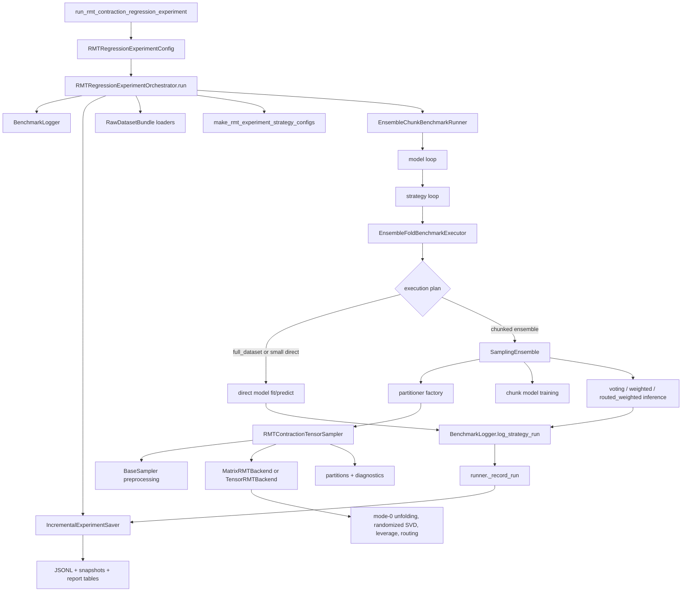
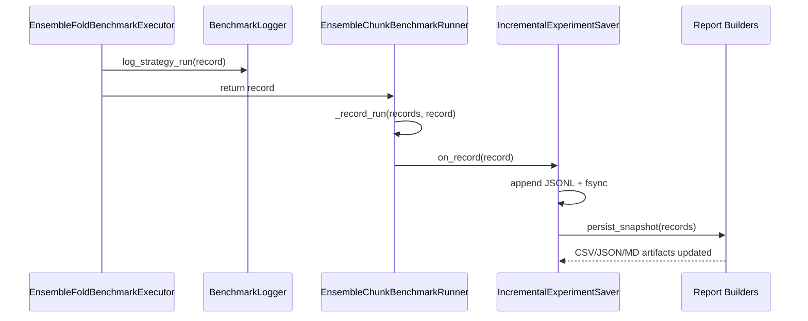

# RMT Contraction Branch: Interaction Concept

Этот документ объясняет, как классы семлперов и классы запуска эксприментов 
взаимодействуют друг с другом на примере запуска `run_rmt_contraction_regression_experiment`. 
Документ предоставляет быструю карту системы: 
где начинается эксперимент, кто отвечает за датасеты, кто строит чанки, кто обучает модели,
где сохраняются результаты и где находится RMT-математика.

## Быстрая Карта

Главная идея ветки: benchmark runner не должен знать математические детали RMT-семплера, 
а RMT-семплер не должен знать про OpenML, модели, отчеты. Система разделена на несколько уровней:

- entrypoint: собирает конфигурацию запуска;
- orchestrator: задает порядок этапов эксперимента;
- benchmark runner: разворачивает сетку `dataset x model x strategy`;
- fold executor: отвечает за split, fold-level запуск и выбор direct/ensemble режима;
- ensemble: строит partitions, обучает модель на каждом chunk и агрегирует прогнозы;
- sampler: строит chunks;
- spectral backend: выполняет вычилсения для оценки спектра;
- logger/saver/report builder: фиксируют результаты инкрементально и собирают отчеты.



### Architecture Map


## Основной Сценарий Запуска

Публичная функция `run_rmt_contraction_regression_experiment(...)` создает `RMTRegressionExperimentConfig`
и передает его в `RMTRegressionExperimentOrchestrator`. В этой функции должны оставаться 
только пользовательские параметры запуска: список OpenML regression tasks, модели, `budget_ratios`, seed, 
output directory, row cap, progress flags.

`RMTRegressionExperimentOrchestrator.run()` является публичным pipeline-методом. 
Он не должен содержать длинную бизнес-логику внутри себя. Его роль - вызвать последовательность внутренних операций:

1. `_prepare_runtime()`
2. `_create_logger()`
3. `_create_incremental_recorder(logger)`
4. `_create_runner(logger)`
5. `_load_datasets()`
6. `_build_strategy_configs()`
7. `_run_experiment(...)`
8. `_build_report_artifacts(...)`
9. `_write_run_metadata(...)`
10. `_announce_completion(logger)`

Если во время запуска падает отдельный fold, `EnsembleFoldBenchmarkExecutor` записывает failed-record 
и возвращает управление runner-у.
Если падает весь процесс, `RMTRegressionExperimentOrchestrator.run()` вызывает `IncrementalExperimentSaver.mark_failed(error)`, чтобы уже полученные результаты не потерялись.


## Сетка Эксперимента

В этой ветке `run_rmt_contraction_regression` оставляет основную экспериментальную ось через `budget_ratio`. Ранее `chunk_fraction` и `budget_ratio` могли работать как две похожие ручки управления размером чанков. Сейчас `chunk_fraction` вынесен из основной grid-логики, а `budget_ratio` остается глобальной policy после формирования partitions.

Типичный порядок вложенных циклов:

```text
dataset
  model
    strategy config
      fold
        direct model or chunked ensemble
```

`EnsembleChunkBenchmarkRunner` отвечает за три верхних уровня: 
dataset, model, strategy. Все, что связано с folds, split, train/validation, direct-vs-ensemble plan и fold-level logging, делегируется в `EnsembleFoldBenchmarkExecutor`.


## Границы Ответственности

| Компонент | Чем владеет | Чем не владеет |
|---|---|---|
| `RMTRegressionExperimentOrchestrator` | Порядок этапов benchmark run, создание logger/saver/runner, загрузка datasets, сборка strategy configs, финальные artifacts | Fold-level split, обучение chunk-моделей, RMT-математика |
| `EnsembleChunkBenchmarkRunner` | Итерация по моделям и стратегиям для одного dataset, передача records в saver | Детали partitioning, routing, SVD, OpenML preprocessing |
| `EnsembleFoldBenchmarkExecutor` | Fold split, train/validation split, direct/ensemble plan, fold-level execution | Сохранение итоговых таблиц, численные backend kernels |
| `SamplingEnsemble` | Создание partitioner, применение budget policy, обучение chunk-моделей, ensemble inference | Загрузка OpenML tasks, построение benchmark report |
| `RMTContractionTensorSampler` | Оркестрация RMT chunking: preprocessing, random views, unfolding, spectral basis, cluster partitions, diagnostics | Обучение прогнозных моделей, CSV/JSON reports |
| `MatrixRMTBackend` / `TensorRMTBackend` | Численные kernels: unfolding, randomized SVD, projection, routing distances | Strategy configs, KMeans partitions, model training |
| `BenchmarkLogger` | Структурное логирование run records и metrics snapshots | Решение, какие эксперименты запускать |
| `IncrementalExperimentSaver` | Durable JSONL append, snapshot rebuild, run metadata status | Метрики моделей, математика sampler-а |
| `RMTReportTableBuilder` | Производные таблицы по records: raw runs, efficiency curve, minimal budget | Запуск эксперимента |

## Инкрементальное Сохранение

После каждого leaf-run record происходит цепочка:



Инкрементальное сохранение важно для длинных запусков с OpenML, LightGBM, TabPFN или большими RMT-samplers. Если процесс прервется после нескольких моделей, уже записанные `metrics/rmt_regression_runs.jsonl` и промежуточные tables останутся в output directory.


## RMT Путь Внутри Ensemble

Для `sampler="rmt_contraction"` процесс выполнения выглядит так:

1. `SamplingEnsemble.prepare_data_partitions(...)` создает `RMTContractionTensorSampler`.
2. Sampler выполняет tabular preprocessing через `BaseSampler`.
3. Sampler генерирует random views (`ViewSpec`) и строит mode-0 unfolding.
4. Backend считает randomized SVD до initial rank.
5. Sampler выбирает selected rank по explained variance.
6. Sampler строит sample embedding, KMeans clusters и partitions.
7. `SamplingEnsemble.train_partition_models(...)` обучает отдельную модель на каждом partition.
8. `SamplingEnsemble.ensemble_predict(...)` объединяет predictions через `voting`, `weighted` или `routed_weighted`.

```mermaid
flowchart LR
    X["tabular X"] --> PP["BaseSampler preprocessing"]
    PP --> RV["random views"]
    RV --> M["mode-0 unfolding M"]
    M --> SVD["backend randomized SVD"]
    SVD --> Rank["adaptive rank selection"]
    Rank --> Emb["sample embedding"]
    Emb --> KM["KMeans clusters"]
    KM --> Part["partitions"]
    Part --> Models["chunk models"]
    Models --> Pred["ensemble prediction"]
```



### RMT Sampler Pipeline

```text
ICML-style scientific figure, clean academic vector infographic, white background, muted blue-gray palette with one accent color, minimal typography, precise arrows, thin lines, labeled panels, no photorealism, no 3D glossy rendering, no decorative background, conference-paper figure aesthetics, mathematically clean, visually balanced. RMT sampler pipeline: tabular preprocessing, random feature contractions, mode-0 unfolding matrix, randomized SVD spectrum, adaptive rank selection, leverage scores, KMeans chunks, routed ensemble weights. Use labeled mathematical panels.
```

## Где Расширять Систему

Чтобы добавить новый sampler:

1. Создать или переиспользовать sampler class в `sampling_zoo/core/sampling_strategies`.
2. Если sampler spectral/tensor-based, вынести численные операции в `sampling_zoo/core/sampling_strategies/spectral/backend`.
3. Зарегистрировать strategy в factory, который использует `SamplingEnsemble._create_partitioner`.
4. Добавить config в `make_rmt_experiment_strategy_configs` или отдельную benchmark config factory.
5. Добавить tests на instantiation через `SamplingEnsemble` и smoke-run через runner.

Чтобы добавить новую модель:

1. Добавить builder в benchmark model registry.
2. Убедиться, что модель поддерживает нужный `problem_type`.
3. Для GPU-sensitive моделей использовать helper, который выбирает device через torch/CUDA и поддерживает env override.
4. Добавить небольшой test на kwargs builder и model key.

Чтобы добавить новую таблицу отчета:

1. Добавить transformation в `RMTReportTableBuilder` или отдельный report builder.
2. Подключить builder как snapshot hook в `RMTRegressionExperimentOrchestrator._create_incremental_saver`.
3. Проверить, что таблица корректно собирается после одного record и после пустого/failed run.

### Text2Image Prompt: Extension Points

```text
ICML-style scientific figure, clean academic vector infographic, white background, muted blue-gray palette with one accent color, minimal typography, precise arrows, thin lines, labeled panels, no photorealism, no 3D glossy rendering, no decorative background, conference-paper figure aesthetics, mathematically clean, visually balanced. Extension point map for a benchmark codebase: add sampler, add model, add report table, add dataset source. Show each extension entering through a narrow public interface and reusing the existing runner and saver.
```

