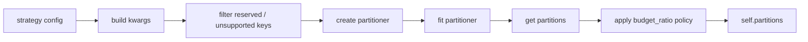

# RMT Contraction Branch: Diagnostics, Routing, Folds And Partitions

Этот документ описывает, какие диагностические метрики фиксируются после обучения sampler-а и ensemble-а, как устроены routing/voting режимы, как делятся datasets на folds, и как формируются partitions.

## Где Лежат Результаты

Каждый запуск `run_rmt_contraction_regression_experiment` создает output directory вида:

```text
examples/benchmark/results/run_rmt_contraction_regression_<timestamp>/
```

Внутри обычно появляются:

| Artifact | Что содержит |
|---|---|
| `logs/strategy_runs.jsonl` | Структурные events от `BenchmarkLogger.log_strategy_run`. |
| `metrics/rmt_regression_runs.jsonl` | Инкрементальный append-only список run records. |
| `metrics/*.json` | Per-strategy/per-fold snapshots. |
| `ensemble_runs.csv` / `ensemble_runs.json` | Основная таблица всех runs. |
| `ensemble_summary.csv` | Aggregated summary по dataset/model/strategy. |
| `rmt_raw_runs.csv` | RMT-focused raw table. |
| `sample_efficiency_curve.csv` | Кривая sample efficiency по budget ratios. |
| `minimal_effective_budget.csv` | Минимальный budget ratio для delta thresholds. |
| `run_meta.json` | Metadata запуска: config, counts, status, timestamps. |
| `report.md` | Markdown summary report. |
| `incremental_saver_errors.jsonl` | Ошибки snapshot hooks или saver-а, если они возникли. |

### Text2Image Prompt: Result Artifacts

```text
ICML-style scientific figure, clean academic vector infographic, white background, muted blue-gray palette with one accent color, minimal typography, precise arrows, thin lines, labeled panels, no photorealism, no 3D glossy rendering, no decorative background, conference-paper figure aesthetics, mathematically clean, visually balanced. Experiment output directory figure: logs, metrics JSONL, ensemble tables, RMT report tables, metadata, markdown report, error log. Show incremental append and snapshot artifacts as separate labeled file stacks.
```

## Run Record: Основные Группы Метрик

Один run record соответствует одному leaf experiment: конкретный dataset, model, strategy, budget ratio и fold.

Типичная структура:

| Группа | Смысл |
|---|---|
| identity fields | `dataset`, `model`, `sampler`, `strategy`, `fold`, `budget_ratio`, `ensemble_method`. |
| model metrics | Для regression: `rmse`, `mse`, `r2`; для classification в общих runners могут быть accuracy/f1/roc_auc. |
| timings | `fit_time`, `inference_time`, sampler/model timings в `timings_sec`. |
| sample stats | Размер train, sample size, coverage ratio, chunk count, chunk sizes, target stats. |
| execution extra | `effective_partitions`, `chunks_percent`, `force_chunking`, `mode`, error payload. |
| sampler diagnostics | RMT-specific diagnostics из `RMTContractionTensorSampler.diagnostics_`. |
| budget policy | Как `budget_ratio` изменил partitions после sampler-а. |

### Text2Image Prompt: Run Record Schema

```text
ICML-style scientific figure, clean academic vector infographic, white background, muted blue-gray palette with one accent color, minimal typography, precise arrows, thin lines, labeled panels, no photorealism, no 3D glossy rendering, no decorative background, conference-paper figure aesthetics, mathematically clean, visually balanced. Run record schema infographic with grouped panels: identity, model metrics, timings, sample stats, sampler diagnostics, budget policy, error state. One completed fold record is shown as a compact structured object.
```

## RMT Sampler Diagnostics

После `RMTContractionTensorSampler.fit(...)` sampler сохраняет `diagnostics_`. Эти поля помогают понять, что именно сделал spectral sampler и насколько устойчиво выглядит разбиение.

| Поле | Интерпретация |
|---|---|
| `backend` | Фактически выбранный backend: `torch` или `numpy`. |
| `device` | Device tensor backend-а, например `cuda` или `cpu`. |
| `dtype` | Численный dtype. |
| `unfolding_shape` | Размер mode-0 unfolding matrix. Большая ширина увеличивает память и SVD cost. |
| `raw_feature_count` | Число исходных признаков. |
| `encoded_feature_count` | Число признаков после preprocessing и one-hot. |
| `feature_cap_applied` | Был ли применен cap до densify. |
| `n_views` | Число random contractions. |
| `view_strategy` | `subsample` или `gaussian`. |
| `initial_rank` | Rank, рассчитанный как доля от размерности unfolding. |
| `selected_rank` | Итоговый rank после explained variance selection. |
| `rank_selection_method` | Сейчас основной метод: `explained_variance`. |
| `explained_variance_threshold` | Порог, например `0.95`. |
| `explained_variance_at_selected_rank` | Фактическая cumulative explained variance на selected rank. |
| `singular_values` | Сингулярные значения до/после truncation, полезны для анализа spectral decay. |
| `leverage_entropy` | Энтропия распределения leverage scores. Низкая энтропия означает концентрацию leverage на малом числе точек. |
| `effective_sample_count` | Эффективное число точек по leverage distribution. |
| `partition_count` | Число построенных partitions. |
| `chunk_sizes` | Размеры chunks после selection/filtering. |

### Как Читать Диагностику

- Если `selected_rank` близок к `initial_rank`, спектр убывает медленно: пространство может быть сложным или threshold слишком высоким.
- Если `leverage_entropy` очень низкая, sampler нашел небольшое число spectral-influential объектов. Это может быть полезно, но стоит проверить стабильность chunks.
- Если `chunk_sizes` сильно несбалансированы, KMeans в embedding может разделять данные на плотное ядро и редкие regions.
- Если `feature_cap_applied=True`, downstream качество надо интерпретировать с учетом потери части one-hot признаков.

### Text2Image Prompt: RMT Diagnostics

```text
ICML-style scientific figure, clean academic vector infographic, white background, muted blue-gray palette with one accent color, minimal typography, precise arrows, thin lines, labeled panels, no photorealism, no 3D glossy rendering, no decorative background, conference-paper figure aesthetics, mathematically clean, visually balanced. RMT diagnostics dashboard figure with panels for singular value spectrum, cumulative explained variance, leverage distribution entropy, effective sample count, chunk size histogram, backend/device badge. Clean academic layout.
```

## Формирование Partitions

### Общий Путь В SamplingEnsemble

`SamplingEnsemble.prepare_data_partitions(...)` работает как pipeline:

1. определить `strategy_name`;
2. собрать kwargs для partitioner-а;
3. убрать служебные и unsupported kwargs;
4. создать partitioner;
5. вызвать подходящий fit-flow;
6. получить partitions;
7. применить `budget_ratio`, если он задан;
8. сохранить `self.partitions` и `self.partitioner`.



### RMT-Specific Partition Formation

Для `RMTContractionTensorSampler` partitions строятся так:

1. tabular features переводятся в dense numeric matrix;
2. random views строят mode-0 unfolding;
3. randomized SVD дает spectral embedding;
4. KMeans делит embedding на `n_partitions` clusters;
5. внутри каждого cluster выбираются строки по `selection_method`;
6. partitions получают имена `chunk_0`, `chunk_1`, ...

Выбор внутри cluster:

| `selection_method` | Поведение |
|---|---|
| `all` | Берет все объекты cluster-а. |
| `leverage` | Отбирает точки с большими leverage scores. |
| `maxvol` | Greedy-выбор точек, которые расширяют объем/разнообразие подпространства. |
| `hybrid` | Сочетает leverage и maxvol-like selection. |

### Budget Policy

В текущем основном experiment grid используется `budget_ratio`. Это глобальный post-partitioning cap:

```text
target_total_rows = round(budget_ratio * train_size)
```

Затем budget распределяется по partitions пропорционально их исходному размеру, а внутри partition выбирается local subset. Так `budget_ratio` контролирует общий размер обучающей выборки ensemble-а без смешивания с RMT-internal `chunk_fraction`.

### Text2Image Prompt: Partition Formation

```text
ICML-style scientific figure, clean academic vector infographic, white background, muted blue-gray palette with one accent color, minimal typography, precise arrows, thin lines, labeled panels, no photorealism, no 3D glossy rendering, no decorative background, conference-paper figure aesthetics, mathematically clean, visually balanced. Partition formation figure: strategy config creates sampler, sampler fits spectral embedding, KMeans creates clusters, selection method picks rows per cluster, budget_ratio trims total rows proportionally, final chunks feed model training.
```

## Разбиение На Folds

Fold logic живет в `EnsembleFoldBenchmarkExecutor`, а не в sampler-е.

### OpenML Raw Dataset

Для OpenML raw bundle используется один заранее подготовленный train/test split:

```text
OpenML dataset -> load_split_data -> FoldSplit(train, test, fold=None)
```

Такой режим нужен, чтобы не держать большой датасет в памяти несколько раз и не создавать лишние CV splits для больших задач.

### Локальный Dataset

Для локальных/обычных bundles используется KFold:

```text
dataset features/target -> KFold(cv_folds) -> FoldSplit(train_idx, test_idx, fold=i)
```

### Train/Validation Split

Для ensemble training нужен validation set, чтобы:

- оценить качество каждой chunk-модели;
- посчитать validation weights;
- сделать forward selection active models;
- контролировать early stopping.

Если train set маленький, executor может не выделять отдельный validation split для direct mode. Если включен forced chunking на малом train, создается небольшой validation split, чтобы ensemble мог корректно оценить chunk-модели.

### Text2Image Prompt: Fold Splitting

```text
ICML-style scientific figure, clean academic vector infographic, white background, muted blue-gray palette with one accent color, minimal typography, precise arrows, thin lines, labeled panels, no photorealism, no 3D glossy rendering, no decorative background, conference-paper figure aesthetics, mathematically clean, visually balanced. Fold splitting figure with two lanes: OpenML raw dataset uses one predefined train/test split; local dataset uses KFold. Both lanes feed train/validation preparation and then direct or ensemble execution.
```

## Direct Model Vs Chunked Ensemble

`EnsembleFoldBenchmarkExecutor._build_execution_plan(...)` выбирает, как выполнить fold:

- `direct`: одна модель обучается на всем train set;
- `ensemble`: данные режутся на partitions, затем обучается модель на каждом chunk;
- forced modes используются для baseline или малых datasets, где нужно явно проверить chunking.

Direct baseline важен для `RMSE_ref`: он задает точку сравнения для sample efficiency curve и minimal effective budget.

### Text2Image Prompt: Execution Plan

```text
ICML-style scientific figure, clean academic vector infographic, white background, muted blue-gray palette with one accent color, minimal typography, precise arrows, thin lines, labeled panels, no photorealism, no 3D glossy rendering, no decorative background, conference-paper figure aesthetics, mathematically clean, visually balanced. Execution plan decision figure: input train size and strategy config, branch to full direct model baseline or chunked ensemble, with effective partitions and budget ratio controls shown as small parameter boxes.
```

## Voting, Weighted И Routed Weighted

`SamplingEnsemble.ensemble_predict(...)` поддерживает несколько способов aggregation.

### Voting

Для regression voting - это простое среднее:

```text
y_hat(x) = (1 / K) * sum_k f_k(x)
```

Для classification voting использует class/probability aggregation в зависимости от доступного output-а модели.

### Weighted

Каждая chunk-модель получает validation weight. Для regression типично используется inverse error:

```text
w_k proportional to 1 / error_k
y_hat(x) = sum_k w_k f_k(x)
```

Weights нормализуются, чтобы сумма была равна 1.

### Routed Weighted

Routed weighted добавляет row-wise вероятность принадлежности объекта к partition:

```text
a_k(x) = routing_k(x) * validation_weight_k
w_k(x) = a_k(x) / sum_j a_j(x)
y_hat(x) = sum_k w_k(x) f_k(x)
```

Если partitioner поддерживает `predict_partition_proba`, используется она. Если нет, fallback:

1. `predict_partitions` -> one-hot routing;
2. uniform weights, если routing недоступен.

Это делает `routed_weighted` безопасным для non-routing samplers, хотя максимальный смысл он имеет для `RMTContractionTensorSampler`.

### Text2Image Prompt: Routing Weights

```text
ICML-style scientific figure, clean academic vector infographic, white background, muted blue-gray palette with one accent color, minimal typography, precise arrows, thin lines, labeled panels, no photorealism, no 3D glossy rendering, no decorative background, conference-paper figure aesthetics, mathematically clean, visually balanced. Routed weighted ensemble figure: a test point is projected into spectral embedding, distances to chunk centroids produce routing probabilities, validation scores produce model weights, the two are multiplied and normalized before weighted prediction aggregation.
```

## RMT Routing Математика

В RMT sampler новый объект `x` проходит тот же preprocessing и random views, что и train data. Затем:

```text
M_new = [phi_1(X_new), ..., phi_V(X_new)]
Z_new = M_new V_r S_r^{-1}
```

где `V_r` и `S_r` взяты из train SVD. Далее считаются расстояния до active centroids:

```text
d_c(x)^2 = ||Z_new(x) - mu_c||_2^2
p(c | x) = softmax_c(-d_c(x)^2 / temperature)
```

Shrinkage сглаживает routing:

```text
p_final(c | x) = (1 - shrinkage) p(c | x) + shrinkage / C
```

Параметры:

- `routing_temperature`: управляет резкостью softmax;
- `routing_shrinkage`: защищает от слишком уверенного routing-а;
- `selected_rank`: влияет на embedding и, соответственно, на расстояния;
- `partition_names_`: задает порядок columns в `predict_partition_proba`.

### Text2Image Prompt: RMT Routing Mathematics

```text
ICML-style scientific figure, clean academic vector infographic, white background, muted blue-gray palette with one accent color, minimal typography, precise arrows, thin lines, labeled panels, no photorealism, no 3D glossy rendering, no decorative background, conference-paper figure aesthetics, mathematically clean, visually balanced. Mathematical routing panel: new tabular row, same random contractions, projection with V_r and S_r inverse into spectral embedding, distances to centroids, softmax temperature, shrinkage to uniform prior, probabilities aligned with partition names.
```

## Sample Efficiency И Minimal Effective Budget

`RMTReportTableBuilder` строит две ключевые производные таблицы:

### Sample Efficiency Curve

Для каждой комбинации dataset/model/sampler/ensemble method/budget ratio сравнивается RMSE с baseline:

```text
rmse_drop = (rmse - rmse_ref) / rmse_ref
```

Если `rmse_drop <= delta`, budget считается эффективным при заданном delta.

### Minimal Effective Budget

Для thresholds `delta = 1%, 3%, 5%` выбирается минимальный `budget_ratio`, который удерживает качество в допустимой зоне относительно baseline. Это отвечает на главный практический вопрос: какую долю train data нужно оставить, чтобы получить почти такое же качество.

### Text2Image Prompt: Sample Efficiency

```text
ICML-style scientific figure, clean academic vector infographic, white background, muted blue-gray palette with one accent color, minimal typography, precise arrows, thin lines, labeled panels, no photorealism, no 3D glossy rendering, no decorative background, conference-paper figure aesthetics, mathematically clean, visually balanced. Sample efficiency figure: budget ratio on x-axis, RMSE drop on y-axis, horizontal delta thresholds at 1, 3, 5 percent, minimal effective budget marked by vertical lines for each threshold.
```

## Практические Инварианты Для Тестов

Для поддержки этой ветки полезно проверять следующие инварианты:

- `predict_partition_proba(X).sum(axis=1) == 1` с численной tolerance;
- порядок probabilities совпадает с `partition_names_`;
- `selected_rank <= initial_rank`;
- при нулевом spectrum selected rank fallback-ится к `min_rank`;
- sparse one-hot cap применяется до densify;
- `routed_weighted` не падает на samplers без routing API;
- `budget_ratio` уменьшает общий train row count, но не создает пустые partitions без необходимости;
- каждый completed fold создает incremental JSONL record;
- failed fold возвращает structured failed record и не прерывает весь dataset run;
- report tables умеют собираться из одного record и из пустого набора records.

### Text2Image Prompt: Test Invariants

```text
ICML-style scientific figure, clean academic vector infographic, white background, muted blue-gray palette with one accent color, minimal typography, precise arrows, thin lines, labeled panels, no photorealism, no 3D glossy rendering, no decorative background, conference-paper figure aesthetics, mathematically clean, visually balanced. Test invariant checklist figure for RMT benchmark: routing probabilities sum to one, selected rank bounded by initial rank, budget policy preserves nonempty chunks, incremental record saved per fold, report tables rebuild after each record.
```

