# Null-калиброванные спектральные диагностики RMT

## Зачем нужен этот слой

Большое сингулярное значение само по себе не доказывает наличие полезного
низкорангового сигнала. Оно может возникнуть из-за масштаба признаков,
конечной выборки или случайных contractions. `SpectralNullDiagnostic`
сравнивает спектр исходного unfolding с эмпирическими reference
распределениями.

На текущем этапе это **только диагностический слой**. Он не меняет
`selected_rank`, partitions или routing. Production rank по-прежнему
выбирается по explained variance. Такое разделение позволяет сначала проверить
статистическую состоятельность метрик на контролируемых данных, а затем
отдельным изменением включить null edge в rank policy.

Файлы:

- `sampling_zoo/core/sampling_strategies/spectral/null_diagnostics.py`;
- `sampling_zoo/core/sampling_strategies/spectral/rmt_contraction_sampler.py`;
- `examples/benchmark/rmt_report_tables.py`.

## Архитектурная граница

`SpectralNullDiagnostic` не знает о Torch, sklearn и структуре sampler-а. Он:

1. строит reference dataset согласно выбранной policy;
2. вызывает переданный `spectrum_evaluator`;
3. сворачивает полученные спектры в immutable contracts;
4. возвращает typed status и typed failures.

Сам `RMTContractionTensorSampler` интерпретирует запрос на спектр через уже
выбранный `MatrixRMTBackend` или `TensorRMTBackend`. Поэтому SVD и contractions
остаются в backend-слое, а статистическая логика остается тестируемым pure
core.

```mermaid
flowchart LR
    A["encoded train X"] --> B["reference policy"]
    B --> C["surrogate X / new views"]
    C --> D["active RMT backend"]
    D --> E["reference spectrum"]
    E --> F["pure summary"]
    F --> G["typed diagnostic result"]
    G --> H["sampler diagnostics"]
    H --> I["raw and efficiency reports"]
```



Reference spectra вычисляются последовательно. В памяти одновременно не
накапливаются unfolding matrices, только короткие массивы сингулярных
значений.

## Reference policies

### `feature_permutation`

Строки независимо переставляются внутри каждого encoded feature:

```text
X_null[:, j] = permutation_j(X[:, j])
```

Маргинальное распределение каждого столбца сохраняется, а межпризнаковые и
межстрочные зависимости разрушаются. Это default primary null model.

### `moment_matched_gaussian`

Для каждого столбца строится Gaussian surrogate с теми же средним и
стандартным отклонением:

```text
X_null[:, j] ~ Normal(mean(X[:, j]), std(X[:, j])^2)
```

Реализация дополнительно нормирует конечную генерацию, поэтому первые два
выборочных момента совпадают. Константные признаки остаются константными.

Policy проверяет, не объясняется ли спектр только масштабом и первыми двумя
моментами. Она сильнее разрушает форму маргинальных распределений, чем
permutation.

### `view_resampling`

Исходный encoded dataset не меняется, но contractions генерируются заново.
Это не null model, а `stochastic_reference`. Она отвечает на другой вопрос:
воспроизводятся ли компоненты, превышающие primary null edge, при новой
случайной реализации views.

Поэтому `view_resampling` нельзя выбрать как `null_primary_policy`.

## Метрики

Пусть `s_1 >= ... >= s_r` — наблюдаемый широкий спектр, а
`s^(b)` — спектр reference replicate `b`.

### Empirical bulk edge

Для null policy:

```text
edge_b = max_j s_j^(b)
bulk_edge_q = quantile_q(edge_1, ..., edge_B)
```

`rank_by_null_edge` равен числу наблюдаемых компонент выше `bulk_edge_q`.

### Outlier excess

```text
excess_j = max(s_j - bulk_edge_q, 0)
```

`null_max_outlier_excess` показывает силу наиболее выраженного spectral
outlier в исходных единицах сингулярных значений.

### Empirical selection frequency

Для null policy:

```text
frequency_j = mean_b[s_j > edge_b]
```

Для `view_resampling`:

```text
frequency_j = mean_b[s_j^(b) > primary_bulk_edge]
```

`rank_by_stability` — число компонент, у которых frequency не ниже
`null_min_selection_frequency`.

### Empirical p-value

Для null policies используется finite-sample correction:

```text
p_j = (1 + count_b[edge_b >= s_j]) / (B + 1)
```

Эта величина является диагностической. Она не заменяет поправку на
множественные сравнения и не должна без дополнительной валидации
интерпретироваться как формальный статистический тест.
Для `view_resampling` empirical p-value намеренно не рассчитывается: эта policy
является stability reference, а не нулевой моделью.

## Конфигурация

```python
RMTContractionTensorSampler(
    null_diagnostic_enabled=True,
    null_model_policies=(
        "feature_permutation",
        "moment_matched_gaussian",
        "view_resampling",
    ),
    null_resamples=16,
    null_quantile=0.95,
    null_min_selection_frequency=0.80,
    null_primary_policy="feature_permutation",
)
```

В benchmark defaults диагностика выключена, потому что ее стоимость примерно
линейна по числу policies и resamples:

```text
additional SVD calls = len(null_model_policies) * null_resamples
```

Для первой отладки достаточно `null_resamples=4`; для исследовательского
сравнения рекомендуется не менее 16, а итоговый порог следует проверять на
большем числе resamples.

Через benchmark grid параметры можно передать в `extra_strategy_params` для
`rmt_contraction`.

## Поля результата

В `sampler.diagnostics_` доступны:

| Поле | Смысл |
|---|---|
| `null_model_status` | `disabled`, `ok`, `partial` или `failed`. |
| `null_primary_policy` | Policy, задающая основной empirical bulk edge. |
| `null_empirical_bulk_edge` | Primary null edge. |
| `rank_by_null_edge` | Число observed components выше primary edge. |
| `rank_by_stability` | Число устойчивых components по view resampling. |
| `null_max_outlier_excess` | Максимальное превышение primary edge. |
| `null_successful_resamples` | Суммарное число успешных reference fits. |
| `initial_singular_values` | Широкий спектр до explained-variance truncation. |
| `spectral_null_diagnostic` | Полный typed-result, сериализованный в dict. |

Внутри `spectral_null_diagnostic.policies` сохраняются component-wise
quantiles, frequencies, empirical p-values и failures каждого replicate.
Отказ отдельного replicate не прерывает sampler fit: результат получает
`partial`. Если primary policy не дала ни одного спектра, status становится
`failed`, но текущий explained-variance rank остается доступен.

## Как читать совместно с rank diagnostics

- `rank_by_null_edge << rank_by_explained_variance`: explained variance,
  вероятно, удерживает компоненты внутри empirical noise bulk.
- `rank_by_null_edge > 0`, но `rank_by_stability = 0`: outliers зависят от
  конкретной генерации contractions.
- Оба rank равны нулю: нет эмпирических свидетельств отделимого spectral
  signal при выбранных null policies; это не доказывает отсутствие
  нелинейной структуры.
- Сильное расхождение permutation и Gaussian policies указывает, что форма
  маргинальных распределений существенно влияет на спектр.

Principal-angle/subspace stability реализована отдельным opt-in слоем и
описана в `09_spectral_subspace_stability.md`. Объединять ее с null edge в
production rank policy следует только после synthetic controls.

## Text2Image Prompt

```text
ICML-style scientific figure, clean academic vector infographic, white background, muted blue-gray palette with one accent color, minimal typography, precise arrows, thin lines, labeled panels, no photorealism, no 3D glossy rendering, no decorative background, conference-paper figure aesthetics, mathematically clean, visually balanced. Four-panel scientific figure for null-calibrated RMT spectral diagnostics: panel A observed tabular data transformed into random-view mode-0 unfolding and singular spectrum; panel B feature-permutation and moment-matched Gaussian null generators feeding the same backend; panel C empirical distribution of largest null singular values with a 95 percent bulk-edge line and observed spectral outliers above it; panel D view-resampling stability frequencies for components relative to the primary null edge. Clearly distinguish null reference from stochastic stability reference, show equations for bulk edge, outlier excess, empirical p-value, and selection frequency.
```
