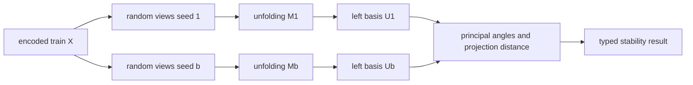

# Устойчивость spectral subspace RMT

## Почему устойчивости singular values недостаточно

Два повторных набора random views могут давать почти одинаковые singular
values, но разные singular vectors. Особенно часто это происходит у близких
или почти вырожденных значений: отдельные векторы свободно вращаются внутри
общего подпространства.

Поэтому существующая `spectrum_stability` отвечает только на вопрос:

> Насколько похожи значения спектра при изменении числа views?

Новая `SpectralSubspaceDiagnostic` отвечает на другой вопрос:

> Насколько воспроизводима геометрия ведущего пространства train-строк при
> повторной генерации contractions?

Диагностика является opt-in и пока не меняет `selected_rank`, partitions или
routing.

## Почему сравнивается левый базис

Для unfolding:

```text
M = U S V^T
```

столбцы `U` находятся в пространстве train-строк размерности `n_samples`.
Это пространство одинаково для всех повторных random views.

Столбцы `V` находятся в координатах конкретного unfolding. После повторной
генерации contractions эти координаты меняют смысл, поэтому прямое сравнение
правых singular vectors некорректно.



## Principal angles

Пусть `Q_1` и `Q_2` — ортонормированные базисы двух подпространств одинакового
ранга `k`. Canonical correlations равны singular values матрицы:

```text
c_i = sigma_i(Q_1^T Q_2)
```

Principal angles:

```text
theta_i = arccos(clamp(c_i, 0, 1))
```

Интерпретация:

- `theta_i = 0` — соответствующие направления полностью совпадают;
- `theta_i = 90 degrees` — направления ортогональны;
- максимальный угол отражает наименее устойчивое направление внутри span.

Метрика инвариантна к знаку singular vectors и к внутреннему вращению полного
подпространства.

## Projection distance

Для проекторов `P_1 = Q_1 Q_1^T` и `P_2 = Q_2 Q_2^T`:

```text
d_projection = ||P_1 - P_2||_F
             = sqrt(2k - 2 * sum_i c_i^2)
```

В отчетах используется нормированная версия:

```text
d_normalized = d_projection / sqrt(2k)
```

Она лежит в `[0, 1]`:

- `0` — подпространства совпадают;
- `1` — подпространства полностью ортогональны.

Реализация не строит плотные матрицы проекторов `n_samples x n_samples`;
расстояние вычисляется через canonical correlations.

## Prefix-rank curve

Для каждого resample сравниваются префиксы:

```text
span(U[:, :1]), span(U[:, :2]), ..., span(U[:, :selected_rank])
```

Для каждого `k` сохраняются:

- mean и выбранный quantile максимального principal angle;
- mean и quantile normalized projection distance;
- mean минимальной canonical correlation;
- доля resamples, одновременно прошедших оба threshold;
- итоговый флаг `stable`.

Rank считается устойчивым, если выбранный quantile:

```text
max_angle_q <= subspace_max_principal_angle_degrees
and
normalized_projection_distance_q
    <= subspace_max_normalized_projection_distance
```

`rank_by_subspace_stability` — максимальный устойчивый prefix rank.

Устойчивость по rank не обязана быть монотонной. Например, при близких
singular values первый singular vector может вращаться и быть нестабильным,
тогда как двумерный span остается полностью воспроизводимым. Поэтому
диагностика не требует, чтобы все меньшие ranks тоже были stable.

## Backend boundary

Численные kernels находятся в backend:

- `MatrixRMTBackend.compare_subspace_prefixes`;
- `TensorRMTBackend.compare_subspace_prefixes`.

Matrix backend использует NumPy, tensor backend выполняет QR, SVD canonical
correlations и расчет расстояний через Torch на выбранном device.

`SpectralSubspaceDiagnostic` не импортирует Torch и не выполняет linear
algebra. Он:

1. детерминированно создает RNG для каждого resample;
2. запрашивает новый левый базис через injected evaluator;
3. передает пары базисов backend comparator-у;
4. агрегирует curves в immutable result contracts;
5. сохраняет typed failures, не прерывая sampler fit.

## Конфигурация

```python
RMTContractionTensorSampler(
    subspace_diagnostic_enabled=True,
    subspace_resamples=16,
    subspace_quantile=0.90,
    subspace_max_principal_angle_degrees=15.0,
    subspace_max_normalized_projection_distance=0.25,
    subspace_max_rank=64,
)
```

Параметры:

| Параметр | Назначение |
|---|---|
| `subspace_diagnostic_enabled` | Включает отдельный diagnostic stage. Default `False`. |
| `subspace_resamples` | Число повторных генераций random views. |
| `subspace_quantile` | Quantile, по которому thresholds применяются к resamples. |
| `subspace_max_principal_angle_degrees` | Допустимый максимальный principal angle. |
| `subspace_max_normalized_projection_distance` | Допустимое нормированное расстояние проекторов. |
| `subspace_max_rank` | Guardrail для максимального rank диагностической prefix curve. `None` отключает cap. |

Benchmark defaults оставляют диагностику выключенной. Параметры можно
передать через `extra_strategy_params["rmt_contraction"]`.

## Поля diagnostics и reports

В `sampler.diagnostics_` и raw report добавлены:

| Поле | Смысл |
|---|---|
| `subspace_stability_status` | `disabled`, `ok`, `partial` или `failed`. |
| `subspace_comparison_rank` | `min(selected_rank, subspace_max_rank)`. |
| `subspace_rank_source` | `selected_rank` или `selected_rank_capped`. |
| `rank_by_subspace_stability` | Максимальный устойчивый prefix rank. |
| `subspace_max_angle_quantile_degrees` | Angle quantile на полном comparison rank. |
| `subspace_normalized_projection_distance_quantile` | Distance quantile на полном rank. |
| `subspace_stability_frequency` | Доля resamples, прошедших оба threshold на полном rank. |
| `subspace_successful_resamples` | Число успешных сравнений. |
| `spectral_subspace_diagnostic` | Полный сериализованный typed result. |

Полный result также содержит `rank_diagnostics`, метрики каждого успешного
replicate на comparison rank и typed failures.

## Совместное чтение rank diagnostics

Теперь доступны четыре разные оценки:

| Поле | Что измеряет |
|---|---|
| `rank_by_explained_variance` | Сколько компонент нужно для spectral energy. |
| `rank_by_null_edge` | Сколько observed components выше empirical null bulk. |
| `rank_by_stability` | Насколько singular values воспроизводятся относительно null edge при новых views. |
| `rank_by_subspace_stability` | Насколько воспроизводим геометрический span ведущих left singular vectors. |

Примеры интерпретации:

- близкие `rank_by_null_edge` и `rank_by_subspace_stability` дают наиболее
  сильное свидетельство устойчивого отделимого сигнала;
- высокий null-edge rank при низком subspace rank означает, что spectral
  outliers есть, но их направления чувствительны к contractions;
- стабильный span при нестабильных отдельных малых prefixes может указывать
  на группу близких singular values, а не на отсутствие структуры;
- нулевые ranks не доказывают отсутствие нелинейного сигнала.

Production rank пока остается explained-variance rank. Контролируемая проверка
recovery на Gaussian и Student-t spiked datasets реализована в
`10_spiked_synthetic_validation.md`. Только после анализа ее результатов
следует отдельным PR вводить явную policy с fallback и
`selected_rank_reason`.

## Вычислительная стоимость

Включение добавляет `subspace_resamples` построений unfolding и SVD.
Prefix comparisons выполняют небольшие SVD матриц не больше
`subspace_comparison_rank x subspace_comparison_rank`. Default cap `64`
ограничивает диагностическую стоимость и не меняет production basis. Все
resamples обрабатываются последовательно.

## Text2Image Prompt

```text
ICML-style scientific figure, clean academic vector infographic, white background, muted blue-gray palette with one accent color, minimal typography, precise arrows, thin lines, labeled panels, no photorealism, no 3D glossy rendering, no decorative background, conference-paper figure aesthetics, mathematically clean, visually balanced. Four-panel scientific figure for RMT spectral subspace stability: panel A one tabular dataset producing two independently resampled random-view unfoldings; panel B left singular bases U1 and U2 in the shared sample space, explicitly contrast with incomparable right bases; panel C principal angles obtained from singular values of Q1 transpose Q2 and normalized projection distance without materializing large projectors; panel D prefix-rank stability curves showing an unstable rank-1 vector but a stable rank-2 span, with angle and distance thresholds and rank_by_subspace_stability highlighted.
```
